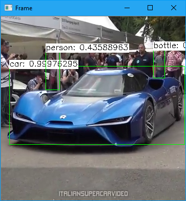

# opencv_mobilenetssd

This is a sample for OpenCV DNN module. It's a object detection using MobileNet-SSD of Caffe trained model.

## Prerequirements

- Python 3.6
- OpenCV 3.4 or above
  - `pip install opencv-python`
  - `pip install opencv-contrib-python`

## Usage

```
python main.py
```



